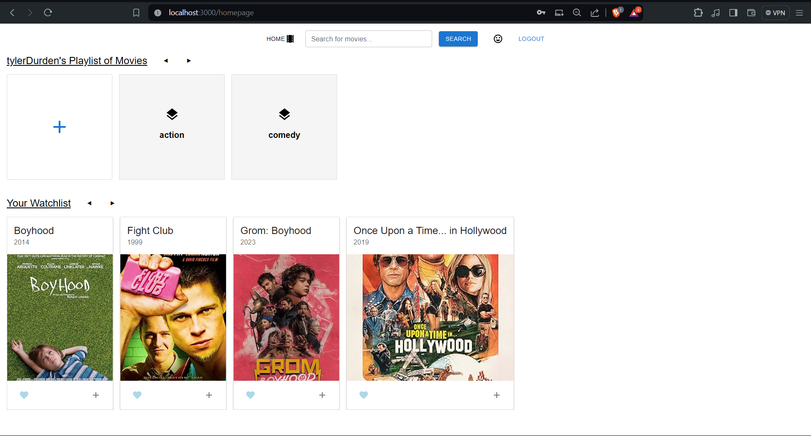
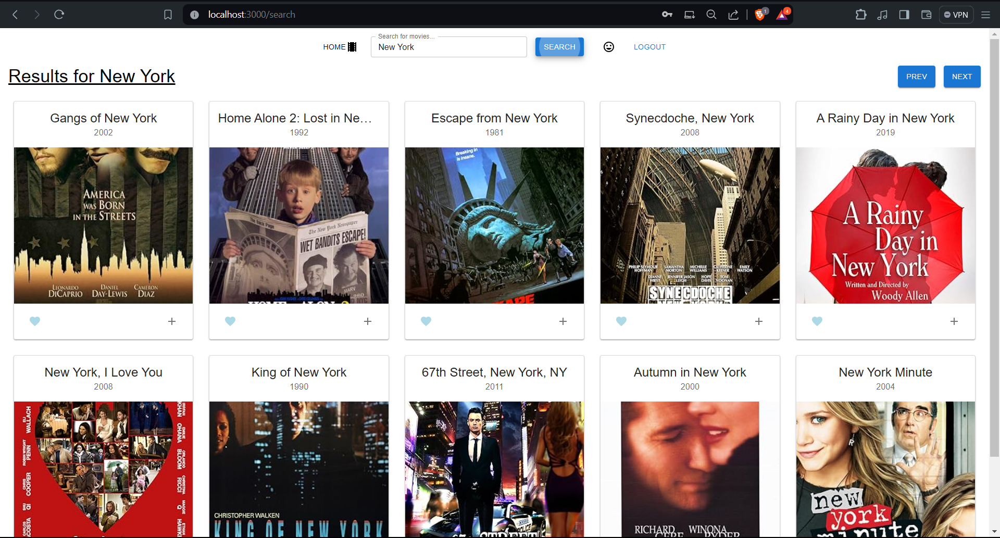
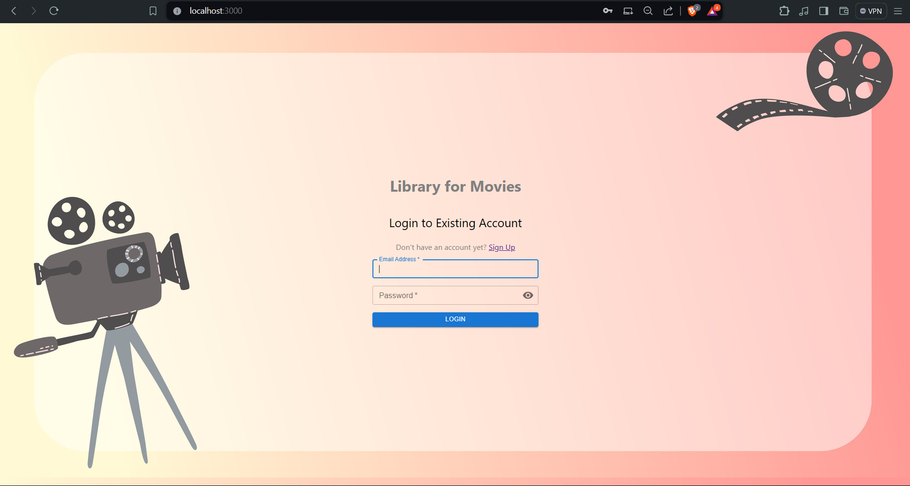
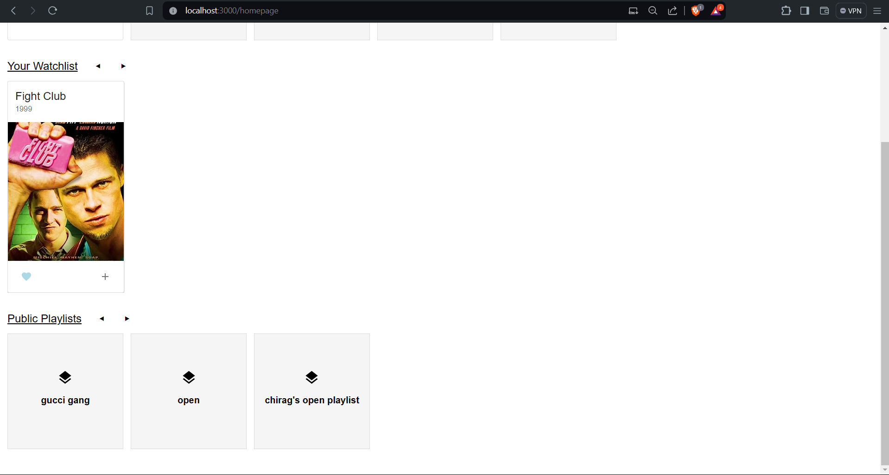

# Movie Library Web Application

Welcome to the web based library for keeping track of movies as per your convenience. Add movies to your watchlist, create playlists and search any movie you want, anywhere, anytime along with a privatized and personalized user experience.

## User Interface and Features

User can create playlist of any name and add movies of his choice to the playlist.

Search is made easy with a searchbar provided in the navbar. Simply type in the movie name and movies will be resulted based on the best match.

Pagination has also been implemented incase the movie you are searching for does not appear in the initial search. Simply click on next or previous button as per your need.

Login along with signup capabilities are implemented to provide the user with a sense of belonging and create their own private space to enjoy movies.

Make public and private playlists and also check out public playlists from users across the platform.

# Technology Stack

| Technology    | Description                                                                                      | Usage in Project                                                                                   |
|---------------|--------------------------------------------------------------------------------------------------|----------------------------------------------------------------------------------------------------|
| React         | A JavaScript library for building user interfaces.                                               | Used as the core frontend library to create the user interface components.                         |
| Redux         | A predictable state container for JavaScript apps.                                                | Implemented Redux for managing the application's state in a predictable and centralized manner.     |
| Material UI   | A popular React UI framework for building beautiful, responsive web applications.               | Utilized Material UI components for designing a visually appealing and responsive user interface.   |
| Firebase      | A comprehensive platform provided by Google for building mobile and web applications.            | Integrated Firebase for user authentication and Firestore for real-time data storage and retrieval. |
|               | - Authentication: Firebase Authentication provides backend services, easy-to-use SDKs, and ready-made UI libraries to authenticate users to your app. | Implemented Firebase Authentication for user sign-in and sign-up functionality.                     |
|               | - Firestore: Firebase's flexible, scalable database for mobile, web, and server development.     | Utilized Firestore as the database to store and sync app data in real-time across clients.          |
| Netlify       | A powerful platform for deploying modern web projects.                                             | Deployed the application on Netlify for hosting, continuous integration, and continuous deployment. |

# Deployment

The Project is deployed using Netlify. This is the live link of the website: [Click Here](https://mv-library.netlify.app/) or visit the domain https://mv-library.netlify.app/

# Getting Started with Create React App

This project was bootstrapped with [Create React App](https://github.com/facebook/create-react-app).

## Available Scripts

In the project directory, you can run:

### `npm start`

Runs the app in the development mode.\
Open [http://localhost:3000](http://localhost:3000) to view it in your browser.

The page will reload when you make changes.\
You may also see any lint errors in the console.

### `npm test`

Launches the test runner in the interactive watch mode.\
See the section about [running tests](https://facebook.github.io/create-react-app/docs/running-tests) for more information.

### `npm run build`

Builds the app for production to the `build` folder.\
It correctly bundles React in production mode and optimizes the build for the best performance.

The build is minified and the filenames include the hashes.\
Your app is ready to be deployed!

See the section about [deployment](https://facebook.github.io/create-react-app/docs/deployment) for more information.

### `npm run eject`

**Note: this is a one-way operation. Once you `eject`, you can't go back!**

If you aren't satisfied with the build tool and configuration choices, you can `eject` at any time. This command will remove the single build dependency from your project.

Instead, it will copy all the configuration files and the transitive dependencies (webpack, Babel, ESLint, etc) right into your project so you have full control over them. All of the commands except `eject` will still work, but they will point to the copied scripts so you can tweak them. At this point you're on your own.

You don't have to ever use `eject`. The curated feature set is suitable for small and middle deployments, and you shouldn't feel obligated to use this feature. However we understand that this tool wouldn't be useful if you couldn't customize it when you are ready for it.
